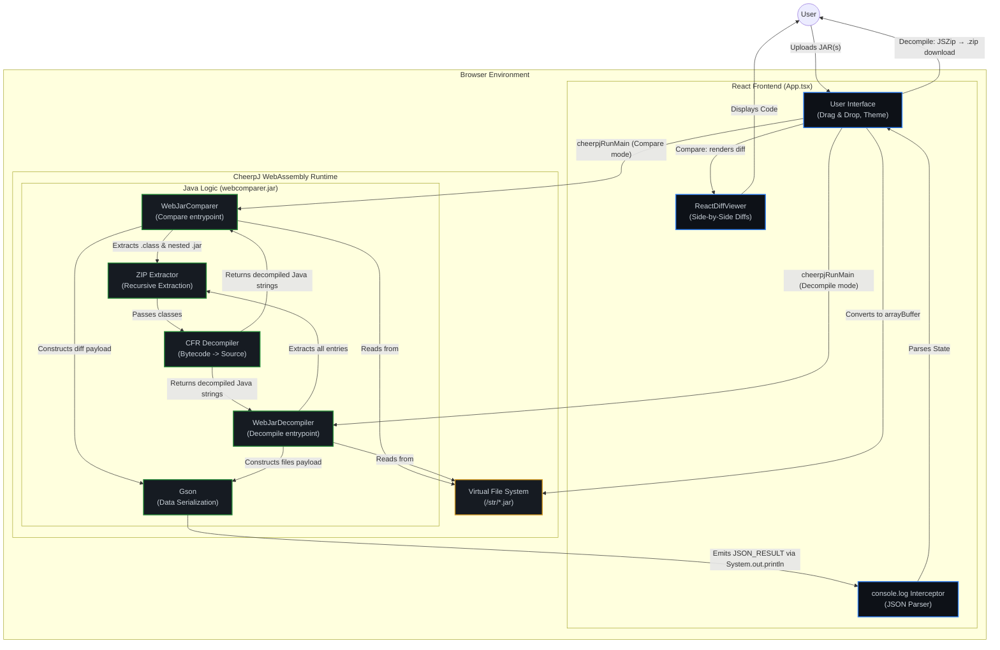

# Client-Side JAR Comparer Architecture

This diagram illustrates the flow of data and execution inside the completely client-side JAR application. It highlights how the React frontend interacts with the Java backend logic running natively in the browser via WebAssembly (CheerpJ).

The app has **two modes** sharing the same engine (`webcomparer.jar`) and the same console-hook IPC:

- **Compare** → `WebJarComparer` diffs two JARs and returns a JSON diff.
- **Decompile** → `WebJarDecompiler` decompiles one JAR to source + resources, which the UI repackages into a downloadable `.zip` (via JSZip).

### Key Architectural Decisions

1. **CheerpJ WebAssembly (Wasm)**: By running the Java Virtual Machine natively inside the browser, the application completely bypasses the need for a backend server. This ensures 100% data privacy and instant file uploads since JAR files never leave the user's machine.
2. **Virtual File System (VFS)**: CheerpJ exposes a virtual file system (`window.cheerpOSAddStringFile`). React converts the HTML5 `File` objects into `Uint8Array` buffers and mounts them into the VFS where standard Java `java.io.File` APIs can interact with them.
3. **IPC via Console Hooking**: Because calling complex Java objects from JavaScript requires heavy JNI-like bindings, this application uses a simpler Inter-Process Communication (IPC) method. The React app overrides `console.log` right before invoking the Java Main class. The Java backend serializes its entire output into JSON, sandwiches it between `JSON_RESULT_START` and `JSON_RESULT_END` flags, and `System.out.println`s it. React parses this block and restores the console hook.
4. **Recursive Unpacking**: The Java logic automatically handles nested JARs (like Spring Boot `BOOT-INF/lib` contents) by unzipping them to virtual temporary directories (`Files.createTempDirectory`) before running the CFR Decompiler.
5. **Shared Engine, Two Entry Points**: A single shaded `webcomparer.jar` bundles both `WebJarComparer` (compare) and `WebJarDecompiler` (decompile). The mode chosen in the UI simply changes which main class `cheerpjRunMain` invokes — no separate downloads, and both reuse the same CFR/Gson/IPC plumbing.
6. **Client-Side Packaging**: In Decompile mode the Java side emits every file as JSON (`utf8` text, or `base64` for binaries). The React app rebuilds the directory tree with **JSZip** entirely in the browser and triggers a `.zip` download, keeping the "no backend, no uploads" guarantee.
