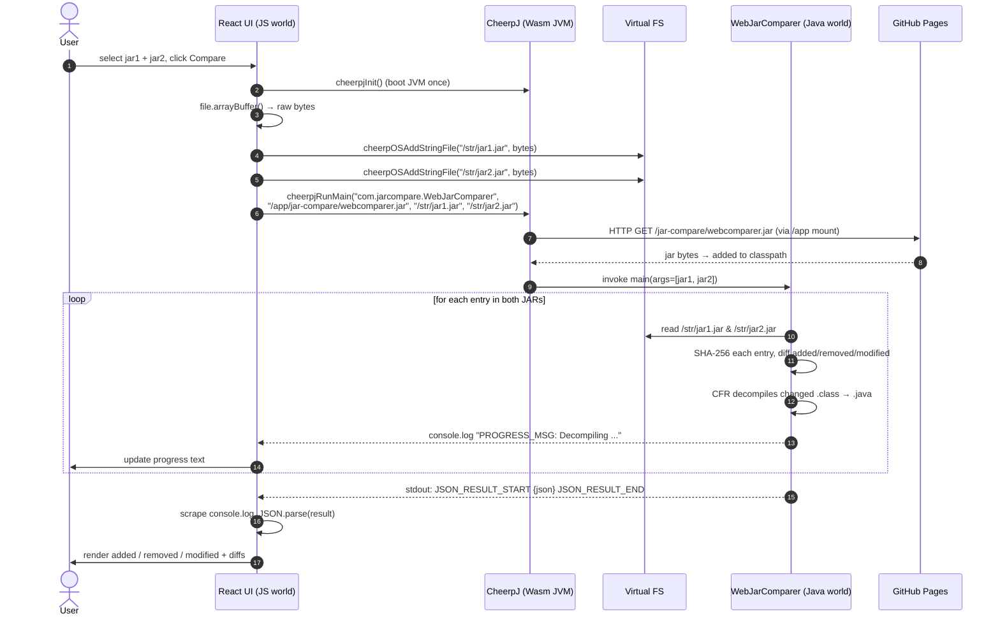
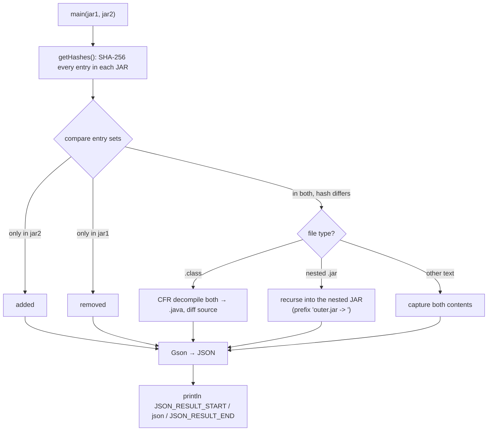

# jar-compare — Architecture

A tool that compares two Java `.jar` files **entirely inside the browser**.
There is no backend server doing the comparison — the Java comparison engine
runs in your browser tab using **WebAssembly**.

---

## 1. WebAssembly in 5 minutes (start here)

If you're new to WebAssembly (Wasm), this is the key idea:

> **WebAssembly is a way to run non-JavaScript code (C, C++, Rust, and even a
> whole Java Virtual Machine) inside a web browser, at near-native speed.**

A browser historically could only run **JavaScript**. WebAssembly adds a
second thing the browser can execute: a compact binary instruction format
(`.wasm`) that runs in the same secure sandbox as the page. It cannot touch
your disk or network directly — it can only do what the surrounding
JavaScript hands it.

### Where Wasm fits in this project

This app needs to run **Java code** (the `.class`/`.jar` comparison logic).
Browsers can't run Java. So we use **CheerpJ**:

```
        Java bytecode (.jar)
               │
               ▼
   ┌───────────────────────────┐
   │  CheerpJ  =  a full Java   │
   │  Virtual Machine (JVM)     │   ← shipped as WebAssembly + JS
   │  compiled to WebAssembly   │
   └───────────────────────────┘
               │
               ▼
     runs inside the browser tab
```

**CheerpJ** (by Leaning Technologies) is a JVM that has itself been compiled
to WebAssembly. So the browser runs Wasm (CheerpJ), and CheerpJ in turn runs
your Java bytecode. It's a "JVM inside the browser."

Think of it as nesting dolls:

```
Browser tab
└── JavaScript (React UI)
    └── WebAssembly module = CheerpJ JVM
        └── Java bytecode = webcomparer.jar  (your comparison engine)
            └── loads + decompiles the two user JARs
```

Two consequences worth internalizing:

1. **Nothing is uploaded.** The two JARs the user picks never leave their
   machine. They're read as bytes in JavaScript and handed to the in-browser
   JVM. Great for privacy; the whole app is static files.
2. **There are "two worlds"** that only talk through narrow bridges:
   the **JS world** (React) and the **JVM world** (CheerpJ). They exchange
   data through (a) a virtual filesystem and (b) `stdout`/`console.log`.
   More on this below.

---

## 2. High-level component diagram

```mermaid
flowchart TB
    subgraph Browser["🌐 Browser Tab (everything runs here)")"]
        direction TB
        UI["React + TypeScript UI<br/>(App.tsx, Vite build)"]

        subgraph CJ["CheerpJ Runtime — a JVM compiled to WebAssembly"]
            direction TB
            VFS["Virtual Filesystem<br/>/str/ (in-memory)  •  /app/ (HTTP-backed)"]
            JVM["WebAssembly JVM"]
            JAR["webcomparer.jar<br/>com.jarcompare.WebJarComparer"]
            LIBS["bundled libs:<br/>Gson (JSON) • CFR (decompiler)"]
            JVM --- JAR
            JAR --- LIBS
            JVM --- VFS
        end

        UI -- "loader.js (CheerpJ 4.3)" --> CJ
    end

    Pages["GitHub Pages<br/>emindu.github.io/jar-compare/"]
    UI -. "fetches static assets" .-> Pages
    VFS -. "HTTP GET webcomparer.jar via /app mount" .-> Pages

    User(["👤 User picks 2 .jar files"]) --> UI
```

**Component roles**

| Component | Tech | Job |
|---|---|---|
| **UI** | React + TypeScript, built by Vite | File pickers, progress, renders the diff |
| **CheerpJ loader** | `loader.js` from a CDN | Boots the Wasm JVM, exposes `cheerpjInit` / `cheerpjRunMain` |
| **Virtual filesystem** | CheerpJ | `/str/` holds the user's JAR bytes; `/app/` proxies HTTP for `webcomparer.jar` |
| **webcomparer.jar** | Java (prebuilt, checked in) | The actual comparison engine (`WebJarComparer.main`) |
| **Gson** | Java lib (shaded in) | Serializes the diff result to JSON |
| **CFR** | Java lib (shaded in) | Decompiles changed `.class` files back to readable `.java` |
| **GitHub Pages** | Static hosting | Serves the React build *and* `webcomparer.jar` |

---

## 3. Runtime sequence — what happens on "Compare"



### The two bridges between JS and Java (the important part)

Because the React (JS) and the comparator (Java) live in separate worlds,
they communicate **only** through two channels:

**Bridge A — files in / classpath (JS → Java):**
```js
// JS writes the user's bytes into the JVM's virtual filesystem
window.cheerpOSAddStringFile("/str/jar1.jar", new Uint8Array(buffer1));
window.cheerpOSAddStringFile("/str/jar2.jar", new Uint8Array(buffer2));

// JS starts the Java program; the JAR itself is fetched over HTTP via /app
const jarPath = "/app" + import.meta.env.BASE_URL + "webcomparer.jar";
//             → "/app/jar-compare/webcomparer.jar"
window.cheerpjRunMain(
  "com.jarcompare.WebJarComparer",  // main class
  jarPath,                          // classpath (downloaded on demand)
  "/str/jar1.jar", "/str/jar2.jar"  // → String[] args of main()
);
```

**Bridge B — stdout out (Java → JS):**
The Java side just calls `System.out.println(...)`. CheerpJ pipes that to the
browser's `console.log`. The React code temporarily **monkey-patches
`console.log`** to scrape three kinds of messages:

```
PROGRESS_MSG:<text>        → drive the progress bar
JSON_RESULT_START ... END  → capture the actual diff payload
(anything else)            → pass through to the real console
```

So the result of the comparison literally travels back as text printed to
stdout, then `JSON.parse`d in JavaScript. Simple and robust.

---

## 4. What the Java engine does (`WebJarComparer`)



Key behaviors:
- **Hash-based diff:** every file inside the JAR is SHA-256'd; sets are
  compared to find added / removed / modified entries.
- **Decompilation:** changed `.class` files are decompiled with **CFR** so the
  UI can show a readable *source* diff, not bytecode.
- **Nested JARs:** if a modified entry is itself a `.jar` (e.g. a fat/uber
  JAR), it recurses, prefixing results with `outer.jar -> `.

---

## 5. Build & deploy pipeline

There are **two separate build artifacts**, and only one of them is built by
CI:

```mermaid
flowchart LR
    subgraph Local["🖥️ Done locally / by hand"]
        JS["jar-compare-java/ (Java source)"]
        MVN["mvn package<br/>(maven-shade-plugin → fat JAR<br/>bundles Gson + CFR)"]
        JAR["webcomparer.jar"]
        COMMIT["committed into<br/>web-app/public/webcomparer.jar<br/>(force-included via .gitignore)"]
        JS --> MVN --> JAR --> COMMIT
    end

    subgraph CI["⚙️ GitHub Actions (on push to main)"]
        CHK["actions/checkout"]
        NODE["setup-node 20 + npm ci"]
        BUILD["npm run build<br/>(tsc -b && vite build)<br/>base = /jar-compare/"]
        DIST["web-app/dist/<br/>(index.html, JS/CSS,<br/>+ copied webcomparer.jar)"]
        UP["upload-pages-artifact"]
        DEP["deploy-pages"]
        CHK --> NODE --> BUILD --> DIST --> UP --> DEP
    end

    COMMIT -.->|in repo| CHK
    DEP --> LIVE["🌐 emindu.github.io/jar-compare/"]
```



**Important nuance:** the workflow does **not** compile the Java. It only
builds the web app. `webcomparer.jar` is a **prebuilt artifact checked into
git**, and Vite copies it from `public/` into `dist/` verbatim. So:

> If you change Java code in `jar-compare-java/`, you must re-run `mvn package`
> and re-commit `web-app/public/webcomparer.jar`, or the live site keeps
> serving the old engine.

Deployment trigger and path:
- Runs on **push to `main`** (or manual `workflow_dispatch`). Not on PR branches.
- Requires repo **Settings → Pages → Source = "GitHub Actions"**.

---

## 6. Why the JAR path mattered (the bug we fixed)

CheerpJ's `/app/` mount maps to the **web-server root (origin)**, not the
folder your page is in. Since the site is served from a subpath
(`/jar-compare/`), the JAR must be addressed including that subpath:

| Code | Resolves to | Result |
|---|---|---|
| `"/app/webcomparer.jar"` | `https://emindu.github.io/webcomparer.jar` | ❌ 404 → "Could not find main class" |
| `"/app" + BASE_URL + "webcomparer.jar"` | `https://emindu.github.io/jar-compare/webcomparer.jar` | ✅ loads |

`import.meta.env.BASE_URL` is `/jar-compare/` in production (from
`vite.config.ts` `base`) and `/` in local dev, so the same line works in both.

---

## 7. File map (where to look)

```
jar-compare/
├── web-app/                      # the front-end (deployed)
│   ├── index.html                # loads CheerpJ loader.js (CDN)
│   ├── vite.config.ts            # base: '/jar-compare/'
│   ├── public/
│   │   └── webcomparer.jar       # prebuilt Java engine (served as-is)
│   └── src/
│       └── App.tsx               # init CheerpJ, feed JARs, run, scrape result
├── jar-compare-java/             # the Java engine source (built locally)
│   ├── pom.xml                   # Gson + CFR deps, shade plugin → fat JAR
│   └── src/main/java/com/jarcompare/
│       ├── WebJarComparer.java   # entry point used by the web app
│       └── JarComparer.java      # CLI variant (manifest Main-Class)
└── .github/workflows/            # build web-app/dist → GitHub Pages
```
