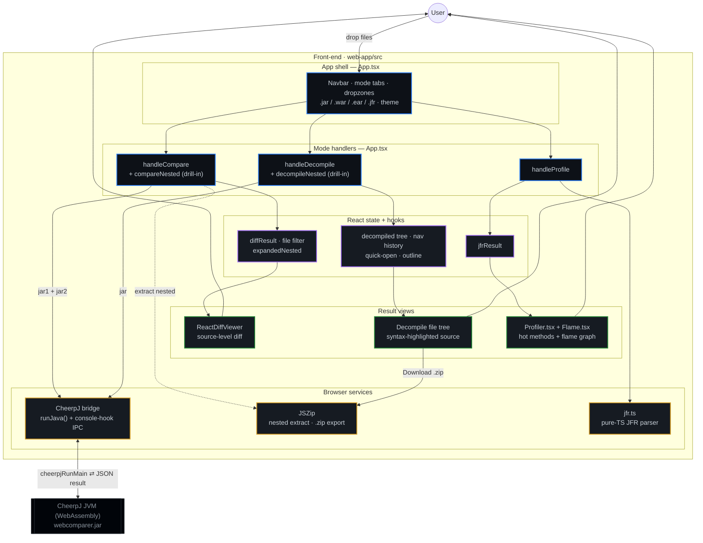

# jar-compare

A **client-side JAR toolkit** with two tools:

- **Compare** — pick two `.jar` files and see exactly what changed between
  them (added / removed / modified entries) with a readable **source-level
  diff** of changed classes.
- **Decompile** — pick one `.jar`, decompile its bytecode back to Java source,
  browse it, and **download the whole source tree as a `.zip`**.

Everything runs **inside your browser**. The Java engine executes via
WebAssembly (CheerpJ), so your JARs are never uploaded to a server.

🔗 **Live app:** https://emindu.github.io/jar-compare/

---

## Features

**Compare mode**
- 📦 **Compare two JARs** entirely in the browser — drag & drop or browse.
- 🔍 **Source-level diffs** — changed `.class` files are decompiled (via CFR)
  so you see readable Java, not bytecode, side by side.
- 🪆 **Nested JAR support** — recurses into JARs packaged inside JARs
  (fat/uber JARs).
- 🧮 **Accurate change detection** — every entry is SHA-256 hashed to classify
  added / removed / modified.
- 🧠 **"Identical source" detection** — flags classes whose bytecode differs
  but whose decompiled source is identical (e.g. recompiled with a different
  compiler or line-number changes).

**Decompile mode**
- 🧩 **De-archive & decompile** a single JAR — every class is decompiled to
  Java source (via CFR), every resource is extracted verbatim.
- 🗂️ **Browse extracted files** — view decompiled sources and text resources
  inline before downloading.
- ⬇️ **Download as `.zip`** — the full source tree is packaged in-browser
  (via JSZip) as `<jarname>-sources.zip`.

**Shared**
- 🌗 **Light / dark theme** — defaults to light; your choice is remembered.
- 🔒 **Private by design** — no backend, no uploads; just static files.

---

## How it works (in one picture)

```
Browser tab
└── React + TypeScript UI   (Compare / Decompile modes)
    └── CheerpJ  (a Java Virtual Machine compiled to WebAssembly)
        └── webcomparer.jar  (the engine — ships two entry points)
            ├── WebJarComparer    → diffs two JARs, returns JSON
            └── WebJarDecompiler  → decompiles one JAR, returns JSON
```

The UI hands the selected JAR(s) to an in-browser JVM, runs the matching Java
entry point, and renders the JSON result it prints back. In Decompile mode the
JSON is repackaged into a downloadable `.zip`.

📖 **Full details:** see [`ARCHITECTURE.md`](./ARCHITECTURE.md) — includes a
beginner-friendly WebAssembly explainer and diagrams of the runtime,
the Java engine, and the build/deploy pipeline.

---

## Front-end architecture

The deployed app is a single-page **React + TypeScript** app under `web-app/src`.
It has three modes — **Compare**, **Decompile**, and **Profile** — that share one
app shell, a per-mode slice of React state, and a small set of browser-side
services. Compare and Decompile hand their archives to the in-browser JVM;
Profile parses `.jfr` recordings **entirely in TypeScript** (no JVM).



**How to read it**

- **App shell / handlers** (blue) — the navbar, dropzones and the per-mode entry
  points in `App.tsx`. Drilling into a nested archive is `compareNested` /
  `decompileNested`.
- **State** (purple) — each mode keeps its own slice of React state (the diff and
  its filter, the decompiled tree with IDE-style navigation, or the parsed JFR).
- **Services** (amber) — the **CheerpJ bridge** (`runJava()` invokes a Java main
  class and reads its JSON back via a `console.log` hook), **JSZip** (extract a
  nested archive from the originals, and export the `.zip`), and **`jfr.ts`** (the
  browser-only JFR binary parser).
- **Views** (green) — how each mode renders its result.
- **Profile never touches the JVM** — `.jfr` files are decoded in TypeScript and
  drawn as a flame graph, so no `webcomparer.jar` round-trip is involved.

---

## Project structure

```
jar-compare/
├── web-app/                      # Front-end (React + Vite) — this is what's deployed
│   ├── public/webcomparer.jar    # Prebuilt Java engine (served as a static asset)
│   └── src/
│       ├── App.tsx               # App shell: modes, state, CheerpJ bridge, results
│       ├── jfr.ts                # Pure-TypeScript JFR (.jfr) binary parser
│       ├── Profiler.tsx          # Profile view: hot-methods table
│       └── Flame.tsx             # Flame-graph renderer
├── jar-compare-java/             # Java engine source (built separately with Maven)
│   └── src/main/java/com/jarcompare/
│       ├── WebJarComparer.java   # Compare entry point (diffs two JARs)
│       ├── WebJarDecompiler.java # Decompile entry point (one JAR → sources)
│       └── JarComparer.java      # Stand-alone CLI variant
├── compare_jars.py               # Python helper / reference implementation
└── .github/workflows/            # Builds web-app and deploys to GitHub Pages
```

---

## Running locally

The deployed app is just the front-end in `web-app/`.

```bash
cd web-app
npm install
npm run dev        # start the Vite dev server
npm run build      # production build into web-app/dist
npm run preview    # preview the production build
```

Then open the printed local URL.

---

## Rebuilding the Java engine

`web-app/public/webcomparer.jar` is a **prebuilt artifact checked into git**.
The deploy workflow does *not* recompile it. If you change anything under
`jar-compare-java/`, rebuild and re-commit the JAR:

```bash
cd jar-compare-java
mvn clean package
# copy the shaded/uber jar into the web app's public folder:
cp target/<your-shaded-jar>.jar ../web-app/public/webcomparer.jar
```

The Maven build (see `pom.xml`) uses the **shade** plugin to bundle the
engine's dependencies — **Gson** (JSON output) and **CFR** (decompiler) —
into a single self-contained JAR.

---

## Deployment

Pushing to `main` triggers the GitHub Actions workflow in
`.github/workflows/`, which:

1. builds `web-app/` (`npm ci && npm run build`, with Vite `base: '/jar-compare/'`),
2. uploads `web-app/dist/` (including `webcomparer.jar`) as a Pages artifact, and
3. publishes it to GitHub Pages.

Requires **Settings → Pages → Source = "GitHub Actions"**.

---

## Tech stack

| Layer | Technology |
|---|---|
| UI | React 19, TypeScript, Vite |
| Diff view | `react-diff-viewer-continued` |
| In-browser JVM | CheerpJ 4.3 (WebAssembly) |
| Comparison engine | Java — SHA-256 diffing + CFR decompilation |
| JSON | Gson |
| Hosting | GitHub Pages (static) |
